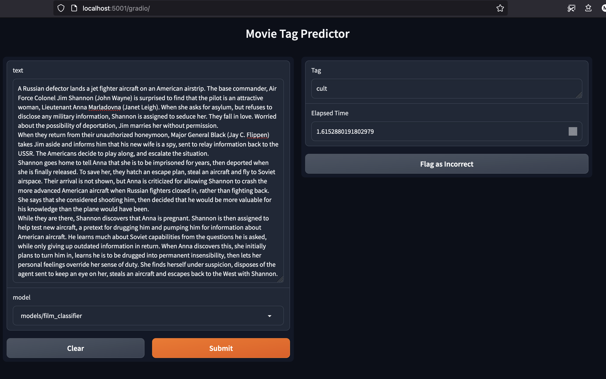

# Movie Classifier API

### Author: Miguel Ângelo Pontes Rebelo

To see it in action simply run: \
read the NOTE in configs/db_config.py \
`make up`

Alternatively (if low on RAM): \
create new environment \
activate environment \
`pip install -r requirements.txt` \
`docker run -p 3306:3306 -d --name mariadb -eMARIADB_ROOT_PASSWORD=password mariadb:latest` \
`uvicorn main:app --reload`

This will use docker compose to build the containers and start them.

You can connect to the db (in a very secure way...):\
host: localhost \
port: 3306 \
user: root \
password: password

To remove them (and the images):
`make down`

The process goes like this:

1. The first time it runs `create_db.py` script that creates the db and table in the MariaDB container.
2. Then runs `train_routine.py` to train the model for the desired task. The films that were not used for training will appear in the logs
3. Starts the API in the port 8000.
4. The API docs is available at 5001/docs (docker) or 8000/docs (local)
5. The gradio app is available at 5001/gradio (docker) or 8000/gradio (local)

**Treats**:

- in utils a singleton pattern assures that the models are only loaded the first time, assuring fast responses for the
  following requests.
- A custom gradio flagger catches the _incorrect_ flag that you can action on the gradio app and stores them in a table, along with text, date, model, result.
- Just copy the synopse and paste it, then wait for the result. It should be pretty fast :)

I hope you like the project.

An example of the UI:
